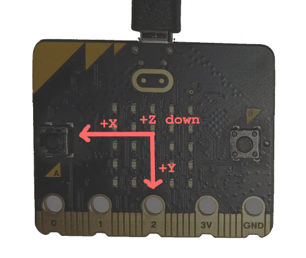

# LED compass

In this section, we'll implement a compass using the LEDs on the micro:bit. Like proper compasses,
our LED compass must point north somehow. It will do that by turning on one of its outer LEDs; the
LED turned on should point towards north.

Magnetic fields have both a magnitude, measured in Gauss or Teslas, and a *direction*. The
magnetometer on the micro:bit measures both the magnitude and the direction of an external magnetic
field, but it reports back the *decomposition* of said field along *its axes*.

The magnetometer has three axes associated with it. When the board is held flat with the LEDs facing
uupward and the logo facing forward, the X and Y axes span the plane that is the floor. The X axis
points to the left edge of the board. The Y axis points to the bottom (card connector) edge of the
board.  The Z axis points "into the floor", so downwards: "upside down" since the chip is mounted on
the back. This is a "right-handed" coordinate system. It's all a bit confusing, since the reported
field strengths are components of the magnetic field vector.

You should already be able to write a program that continuously prints the magnetometer data on the
RTT console from the [I2C chapter](../08-i2c/index.md). After you write that program
(`examples/show-mag.rs`), locate where north is at your current location. Then line up your
micro:bit with that direction and observe how the sensor's X and Y measurements look.

Now rotate the board 90 degrees while keeping it parallel to the ground. What X, Y and Z values do
you see this time? Then rotate it 90 degrees again. What values do you see?

> **NOTE** Of the two MB2s I have handy at the time of this writing, one of them seems to have a
> somewhat broken magnetometer: the Z-axis is unusably offset. The manufacturer has a self-test
> process for detecting this and a calibration process for mitigating this kind of "hard iron"
> fault, which is usually the result of exposing the MB2 to a strong magnetic field at some
> point. However, the `lsm303agr` crate currently doesn't support either of these, and it seems like
> a lot for an introductory guide to embedded systems. If you have only one MB2 and it doesn't seem
> to be working, you may just want to skip to the [next chapter]. Cheap hardware: whatcha gonna do?

[next chapter]: ../10-punch-o-meter/index.html

The Earth's magnetic north is a fickle thing: it differs from true north in most places on Earth,
sometimes substantially. It can point down into the ground quite a bit. It changes over time.
Without allowing for all this, you won't get a very accurate compass even if your MB2 magnetometer
is perfect (it's not). This US NOAA calculator
<https://www.ngdc.noaa.gov/geomag/calculators/mobileDeclination.shtml> can be visited on your mobile
device to get a good estimate of true north as well as magnetic north; you can give this UK BGS
[calculator] your latitude, longitude and altitude to get both declination and inclination.  At my
location the "declination" (difference between true and magnetic north) is about 15°; the
"inclination" is an astonishing 67° down into the ground.

[calculator]: http://www.geomag.bgs.ac.uk/data_service/models_compass/wmm_calc.html

> **NOTE** The LSM303AGR magnetometer is not a particularly accurate device out-of-the box. The
> manufacturer recommends a fancy calibration procedure for finding adjustments to the magnetometer
> readings. You can find further information, a sample calibration implementation and some fancier
> compass graphics in [appendix 3]: since we're doing something fairly basic with the magnetometer
> we won't worry about it in this chapter.

[appendix 3]: ../appendix/3-mag-calibration/index.html
