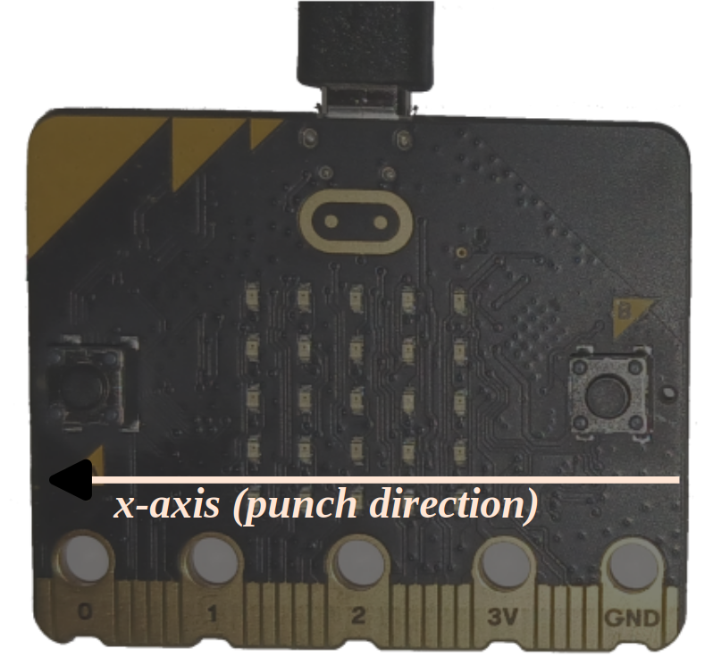

# The challenge

To keep the software simple, we will assume that you punch with the board parallel to the ground. To
measure the magnitude of your punch, you'd need to take into account both X and Y acceleration
(while ignoring Z since it just reflects gravity). To make things even easier, we will assume that
you hold the board with the B button close to you and the A button farther away, then punch away
from yourself. This means that you are punching in the positive X direction.

Here's what the punch-o-meter must do:

- By default, the app is not "observing" the acceleration of the board.
- When a significant X acceleration is detected (i.e. the acceleration goes above some threshold),
  the app should start a new measurement.
- During that measurement interval, the app should keep track of the maximum acceleration observed
- After the measurement interval ends, the app must report the maximum acceleration observed. You
  can report the value using the `rprintln!` macro.

Give it a try and let me know how hard you can punch `;-)`.

> **NOTE** There is an additional API that should be useful for this task that we haven't
> discussed yet: the [`set_accel_scale`] one which you need to measure high g values.
> 
> [`set_accel_scale`]: https://docs.rs/lsm303agr/1.1.0/lsm303agr/struct.Lsm303agr.html#method.set_accel_scale
