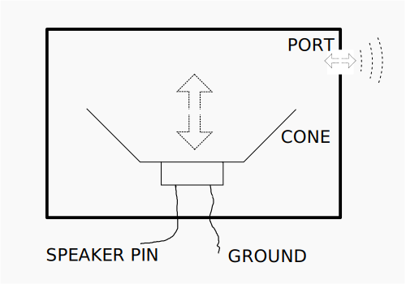

# The MB2 Speaker

Your MB2 has a built-in speaker — the large black square device labeled "SPEAKER" in the middle of
the back of the board.

The speaker works by moving air in response to a GPIO pin: when the speaker pin is high (3.3V) a
diaphragm inside — the "speaker cone" — is pushed all the way out; when the speaker pin is low (GND)
it is pulled all the way back in. As air is pushed out and sucked back in, it flows in and out of
the tiny rectangular hole — the "speaker port" — on the side of the device.  Do this fast enough,
and the pressure changes will make a sound.



With the right hardware driving it, this speaker cone could actually be moved to any position in its
range with an appropriate current. This would allow fairly good reproduction of any sound, like a
"normal" speaker. Unfortunately, limitations in the MB2 hardware controlling the speaker mean that
only the full-in and full-out positions are readily available.

Let's push the speaker cone out and then in 220 times per second. This will produce a "square"
220-cycles-per-second pressure wave. The unit "cycles-per-second" is Hertz; we will be producing a
220Hz tone (a musical "A3"), which is not unpleasant on this shrill speaker.

We'll make our tone for five seconds and then stop. It is important to remember that our program
lives in flash on the MB2 — if we let the tone run forever then it will start up again each time we
reset or even power on the MB2. This can rapidly become quite annoying.

Here's the code (`examples/square-wave.rs`).

```rust
{{#include examples/square-wave.rs}}
```
